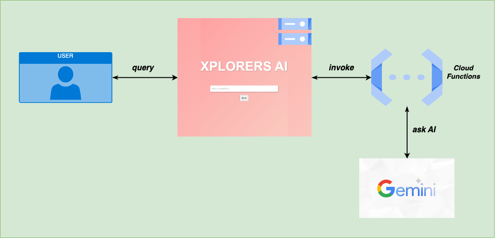
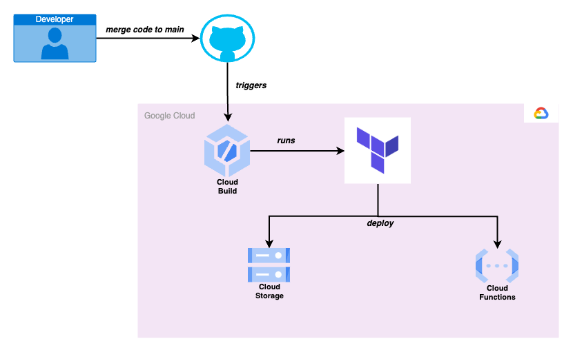

# gcp-static-ai-site-publisher

Automatically publish changes to your static website using CloudBuild and Github

## What is a Static Website?

A static website typically consists of HTML, CSS, and JavaScript files that are served directly to the user's browser without any server-side processing. These files are pre-built and do not change dynamically based on user input or other factors.

## Static AI Website with Dynamic Content

A static website can be enhanced with dynamic content by integrating it with a third-party service that provides dynamic content. In this example, we will demonstrate how to integrate a static AI website hosted in Cloud Storage with a Cloud Functions service. The Cloud Functions service will handle user requests to Gemini AI and display the response to the users.

When a user visits the static website, the website will make a request to the Cloud Functions service, which will in turn make a request to the Gemini AI service. The Gemini AI service will process the request and return the response to the Cloud Functions service, which will then return the response to the user.

## Deployed to Cloud Storage Automatically

This example demonstrates how to automatically deploy a static website to Google Cloud Storage whenever changes are made to the website's content in a Github repository. The deployment process is triggered by a Cloud Build job that builds the static website and deploys it to Cloud Storage.

### How it works

1. Developer makes a change to the static website's content in the Github repository.
2. The developer pushes the changes to the Github repository and merges the changes to the main branch.
3. Github triggers a Cloud Build job to build the static website.
4. Terraform deploys the static website to Cloud Storage.

## Services used:

-   [Google Cloud Platform](https://cloud.google.com/)
    -   [Cloud Build](https://cloud.google.com/cloud-build)
    -   [Cloud Storage](https://cloud.google.com/storage)
    -   [Cloud Functions](https://cloud.google.com/functions)
    -   [Secret Manager](https://cloud.google.com/secret-manager)
    -   [Artifact Registry](https://cloud.google.com/artifact-registry)
-   [Github](https://github.com/)
-   [CloudFlare](https://www.cloudflare.com/)

## Pre-requisites:

### Software:

-   [Google Cloud CLI](https://cloud.google.com/sdk/docs/install)
-   [Terraform](https://learn.hashicorp.com/tutorials/terraform/install-cli)

### Create secrets in Google Cloud Secret Manager:

1. Create a secret in Google Cloud Secret Manager with the name `xplorers-gemini-ai-api-key` and the value of your Gemini AI API key. For more information on how to obtain an API key, refer to the [Gemini AI API documentation](https://ai.google.dev/api?lang=node).

2. Create a secret in Google Cloud Secret Manager with the name `cloudflare-api-key` and the value of your Cloudflare API key. For more information on how to obtain an API key, refer to the [Cloudflare API documentation](https://developers.cloudflare.com/fundamentals/api/get-started/create-token/).

### Create a bucket in Google Cloud Storage for Terraform state

Create a Cloud Storage bucket and update `configuration/defaults.conf` with the name of the bucket

### Update configuration default values

Update the default values in `configuration/defaults.conf` with your project ID, region, and other values.

The variable `STATIC_AI_WEBSITE_BUCKET_NAME` should be set to the name of the bucket where the static website will be deployed.
